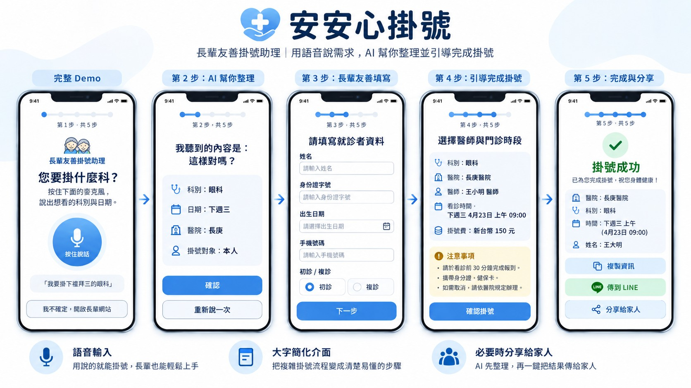

# 🏥 安心掛號 (Anxin Registration) Demo
> **【2026 BUILDMODE HACKATHON】 參賽作品**
> 
> **參賽賽道：** AI for Everyday Life
> 
> **參賽隊伍：** Woooooo It’s AI


## 問題與解法摘要 (Elevator Pitch)

**痛點 (Problem)：**
台灣即將邁入超高齡社會，醫療需求極大。然而，現有醫院的數位掛號系統介面複雜、字體小、步驟繁瑣，導致長者無法獨立操作，只能極度依賴家屬代勞或親赴現場排隊，加深了數位醫療落差。

如同我們整理的視覺化儀表板，揭示多數長者面臨使用數位醫療服務的挑戰；因此，本程式設計希望讓 AI 成為長者與數位醫療系統之間的「翻譯者」與「代理人」。

👉 **[點此觀看：高齡化社會與醫療數位落差 視覺化儀表板](https://cool-bush-b2e3.anchieh2.workers.dev)**


**解法 (Solution)：**
「安心掛號」是一款專為長輩打造的語音掛號 Web App。相較於傳統的下拉式選單與複雜表單，我們改以：
1. **一鍵語音說話** 作為主要輸入方式。
2. 結合 **AI 意圖識別**，自動判斷科別與時間。
3. 導入 **家屬接力** 機制，長輩用說的，最後確認交給家屬，打造無痛的數位就醫體驗。
> **注意：本專案僅為 Hackathon 展示用，不登入真實醫院系統、不接觸真實病患資料，也不會自動送出任何真實掛號。**

🌐 **線上 Live Demo：** [點此體驗安心掛號](https://site-creator-vinext-starter.anxin-reg.workers.dev/)

🎬 **Demo 影片** (https://www.youtube.com/watch?v=O8FuekDZAgs)


  

## 核心特色與已完成功能
**長輩友善語音介面：** 按住說話的錄音介面，自動串接 Whisper 語音轉文字（未設定金鑰時會自動降級使用瀏覽器內建語音辨識）。

**AI 意圖解析：** 透過 LLM 解析語音，精準提取 `intent (意圖) / department (科別) / date (日期)`，並具備無 API Key 時的本地規則解析備援。

**安全與防呆機制：** 支援台灣身分證基本格式校驗（`^[A-Z][0-9]{9}$`），並將「最後確認送出」保留給本人或家屬，絕不自動送出掛號。

**家屬接力掛號：** 支援 LINE 官方分享 URL，可將去識別化（不含身分證）的掛號摘要傳送給家屬確認。

## 技術架構 (Tech Stack)

### 1. 語音辨識與 AI 理解

- **語音輸入：** 使用瀏覽器 `MediaRecorder` 收音，並優先串接 OpenAI Whisper API 將台灣華語轉成文字。
- **意圖解析：** 使用 OpenAI Responses API 與 Structured Outputs，把自然語句整理成 `intent`、`department`、`date` 三個欄位。
- **穩定備援：** API 暫時不可用時，系統會切換到瀏覽器語音辨識與本地規則解析，讓現場 Demo 仍能繼續完成。

### 2. 醫院公開資料層

- 後端透過 `GET /api/cgmh` 唯讀取得台北長庚眼科的公開班表，解析日期、看診時段、醫師與可掛號狀態。
- 為降低公開網站偶發逾時造成的影響，資料層設有重試、逾時控制及 Demo fallback。
- 系統不登入長庚、不存取 HIS 或病患資料，也不會代替使用者送出真實掛號。

### 3. 家屬接力與 LINE 整合

- **手動分享：** 使用 LINE 官方 URL Scheme，讓長輩選擇家人或群組並分享去識別化的掛號摘要。
- **自動通知：** 可選配 LINE Messaging API，把同一份摘要推送給預先設定的家屬帳號。
- 分享內容不包含身分證字號；最終掛號仍由本人或家屬前往長庚官方網站確認。

### 4. 前端、部署與隱私

- **前端：** React 19、TypeScript、響應式大字介面與五步驟引導流程。
- **建置：** Vite、vinext。
- **部署：** Cloudflare Workers，提供公開 HTTPS 網址，支援手機麥克風與 Serverless API Routes。
- **隱私：** 身分證只保留在使用者裝置的瀏覽器狀態中，不寫入資料庫，也不會透過網址或 LINE 傳送。

## 系統流程 (System Flow)

```text
長輩按住說話
      ↓
MediaRecorder → Whisper 語音轉文字
      ↓
LLM Structured Output 解析科別與日期
      ↓
唯讀查詢長庚公開掛號班表
      ↓
選擇日期、醫師並在裝置上準備資料
      ↓
LINE 通知家屬或手動分享
      ↓
本人／家屬前往長庚官網完成最終確認
```

## 本機執行方式 (Local Setup)

本專案即使沒有 AI 金鑰，也能透過備援流程在本機運行。

### 1. 系統需求

**Node.js 22.13** 或以上版本。

### 2. 安裝與啟動

```bash
# 安裝依賴套件
npm install

# 複製環境變數設定檔
cp .env.example .env.local

# 啟動開發伺服器
npm run dev
```

啟動後開啟 <http://localhost:3000>。正式建置可執行 `npm run build`。

### 3. 環境變數設定（選用）

```dotenv
OPENAI_API_KEY=您的_OPENAI_API_金鑰
TRANSCRIPTION_MODEL=whisper-1
INTENT_MODEL=gpt-4o-mini

LINE_CHANNEL_ACCESS_TOKEN=
LINE_CHANNEL_SECRET=
LINE_FAMILY_USER_ID=
```

金鑰只應放在本機 `.env.local` 或部署平台的 Secret 中，絕不提交至 Git。語音錄音為即時處理，不寫入檔案或資料庫。

## 資料來源與安全邊界

### 醫療與研究資料

- 高齡化與數位落差儀表板資料取自國家發展委員會《中華民國人口推估報告》、TWNIC《台灣網路報告》及健保署統計年報。
- 掛號班表來自長庚醫院公開網路掛號頁面；系統僅進行唯讀查詢與畫面轉譯。
- 公開資料無法取得或沒有可用時段時，介面會明確切換成示範資料，實際結果一律以長庚官網為準。

### Demo 安全聲明

- 不登入醫院內部系統。
- 不接觸或儲存真實病歷資料。
- 不自動送出掛號。
- 不在 LINE 訊息或分享網址中包含身分證字號。
- 所有正式掛號操作皆由本人或家屬在長庚官方網站完成。
